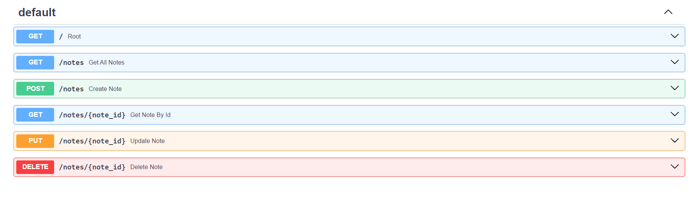

#### FLOW 

1. build & configure the environment

2. install dependencies

3. create fastapi app + index endpoint + run uvicorn for testing

4. define empty endpoints

    

5. create database module
    - connect to pgadmin4 -> create a database
    - configure your connection strings and related env variables inside .env
    - load your environment variables inside databaes.py to connect to asyncpg
    - define table schema and its representation when returned inside the models.py 
